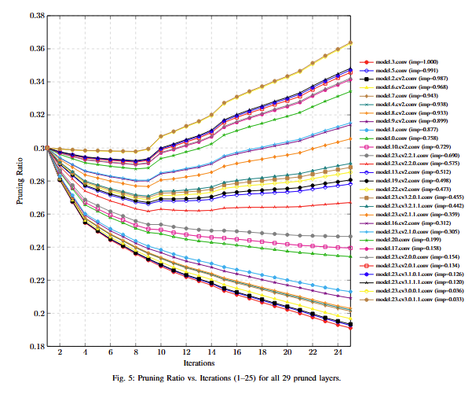
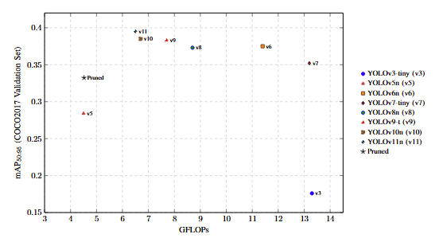

# LIPS-Layer-Importance-Pruning-Schedules-with-Cost-Aware-Step-Adaptation-for-Deep-Detection-Networks

## Introduction

This repository contains the code and experiments for our pruning framework **LIPS (Layer-Importance Pruning Schedules with Cost-Aware Step Adaptation)**, applied to YOLOv11n object detection models. Instead of relying on fixed or uniform pruning ratios, LIPS automatically discovers layer-wise sparsity schedules by combining sensitivity analysis, a directed pruning engine, and a cost-aware iterative optimizer. The resulting pruned models significantly reduce computational cost while preserving detection accuracy and improving real-time inference performance on video streams.

## Layer-Importance–Driven Pruning Ratio Search

LIPS employs a search algorithm that adapts the pruning ratios of each layer based on its measured sensitivity and the global computational constraints. The process begins by estimating the importance of every convolutional layer through a layerwise sensitivity analysis: each layer is temporarily perturbed, the resulting mAP drop is measured, and the values are normalized into an importance vector. Layers that cause larger accuracy degradation are considered highly sensitive and should be pruned less aggressively.

Using this importance profile, LIPS initializes a pruning schedule and then refines it through an iterative, cost-aware optimization loop. At each iteration, the framework evaluates the pruned model, computes its current mAP and GFLOPs, and updates per-layer pruning ratios according to a set of conditional rules:

## Experimental Configuration

The following table summarizes the key parameters used throughout the pruning and fine-tuning pipeline.

| Category | Parameter | Value / Description |
|---------|-----------|---------------------|
| **Base Model** | Architecture | YOLOv11-Nano (Ultralytics) |
| | Initial Weights | COCO-pretrained |
| **Datasets** | Training / Fine-tuning Set | COCO 2017 train (118k images) |
| | Validation Set | COCO 2017 val (5k images) |
| | Evaluation Metrics | mAP@50–95, GFLOPs |
| **Pruning Targets** | Target mAP@50-95/GFLOPs | ≈ **35/4.5 GFLOPs**  |
| **Iterative Optimization** | Total pruning iterations | **25** |
| | Ratio update mechanism | Gate-based increases/decreases per layer |
| | Layer priority | High-importance → prune less; Low-importance → prune more |
| **Fine-tuning Configuration** | Epochs per iteration | **20 epochs** after each pruning step |
| | Optimizer | SGD |
| | Learning Rate | 0.01 |
| | Weight Decay | 5e-4 |
| | Momentum | 0.937 |
| | Batch Size Validation | 32 |
| | Batch Size Fine-tuning | 64 |
| | Image Size | 640 |
| | Warm-up | 3 epochs |
| **Hardware** | GPU used | RTX A100 |

## Results

The table below shows the normalized importance scores for every prunable convolutional layer in YOLOv11n. These values were computed during Stage I (Layerwise Sensitivity Analysis), where each layer was perturbed and its impact on mAP was measured. High-importance layers were pruned less aggressively, while low-importance layers received stronger pruning pressure.

| Layer | Importance | Layer | Importance |
|-------|------------|--------|------------|
| model.3.conv | 1.000 | model.0.conv | 0.757 |
| model.5.conv | 0.991 | model.10.cv2.conv | 0.728 |
| model.2.cv2.conv | 0.986 | model.8.cv2.conv | 0.933 |
| model.6.cv2.conv | 0.968 | model.4.cv2.conv | 0.938 |
| model.7.conv | 0.942 | model.1.conv | 0.876 |
| model.9.cv2.conv | 0.898 | model.13.cv2.conv | 0.512 |
| model.23.cv2.2.1.conv | 0.689 | model.23.cv2.2.0.conv | 0.574 |
| model.22.cv2.conv | 0.472 | model.19.cv2.conv | 0.498 |
| model.23.cv3.2.0.1.conv | 0.455 | model.23.cv3.2.1.1.conv | 0.442 |
| model.23.cv2.1.1.conv | 0.359 | model.23.cv2.1.0.conv | 0.305 |
| model.16.cv2.conv | 0.311 | model.20.conv | 0.198 |
| model.17.conv | 0.158 | model.23.cv2.0.0.conv | 0.153 |
| model.23.cv2.0.1.conv | 0.133 | model.23.cv3.1.0.1.conv | 0.125 |
| model.23.cv3.1.1.1.conv | 0.119 | model.23.cv3.0.0.1.conv | 0.036 |
| model.23.cv3.0.1.1.conv | 0.032 | — | — |

We compare the best pruned YOLOv11n model (iteration 24) against several lightweight YOLO architectures to contextualize its final accuracy and compute efficiency.

| Model | mAP50:95 | GFLOPs |
|-------|----------|---------|
| YOLOv3-tiny | 0.1760 | 13.30 |
| YOLOv5n | 0.2840 | 4.50 |
| YOLOv6n | 0.3750 | 11.40 |
| YOLOv7-tiny | 0.3520 | 13.20 |
| YOLOv8n | 0.3730 | 8.70 |
| YOLOv9-t | 0.3830 | 7.70 |
| YOLOv10n | 0.3850 | 6.70 |
| YOLOv11n | 0.3950 | 6.50 |
| **Pruned (LIPS)** | **0.3323** | **4.52** |

The first plot shows how the pruning ratios evolve across the 25 iterations, where high-importance layers gradually receive smaller pruning rates while low-importance layers are pruned more aggressively according to the gate-based optimization.



The second plot compares the best pruned YOLOv11n model (iteration 24) against several lightweight YOLO architectures, demonstrating that the pruned model achieves a favorable balance between accuracy and computational cost, positioning itself closer to YOLOv5n in GFLOPs while outperforming it in mAP.



## Using `comparison.py`

This script compares two YOLOv11n models (original vs pruned) on a video stream.  
It runs both models frame by frame, renders the detections side by side, and reports average latency and FPS for each model.

### 1. Installation

Make sure you have Python 3.9+ and install the required packages:

```bash
pip install ultralytics opencv-python numpy pyyaml

python comparison.py \
  --video video.mp4 \
  --model_orig yolov11n.pt \
  --model_pruned runs/iter_24/ft/finetune/weights/last_pruned_full.pt \
  --args_yaml runs/iter_24/ft/finetune/args.yaml \
  --save comparison_output.mp4
```  

The script accepts **any YOLOv11n checkpoint** as input, allowing you to compare different iterations, pruning levels, or fine-tuned versions stored in your experiment folders. You can pass any `.pt` file produced during the optimization process, including intermediate checkpoints (e.g., `iter_10`, `iter_17`, etc.) or the final pruned model.

For example, to evaluate the **best-performing model found at iteration 24**, you can simply use:

--model_pruned runs/iter_24/ft/finetune/weights/last_pruned_full.pt

The script produces two types of output:

**Real-time Visualization / Saved Video**  
   A side-by-side comparison video showing:
   - Original model detections on the left  
   - Pruned model detections on the right  
   - Overlay text with average latency (ms/frame) and FPS for each model  
   If the `--save` flag is provided, this visualization is written to an output file (e.g., `comparison_output.mp4`).

Together, these outputs allow you to visually and quantitatively compare accuracy, latency, and computational efficiency between the original and pruned YOLOv11n models.


